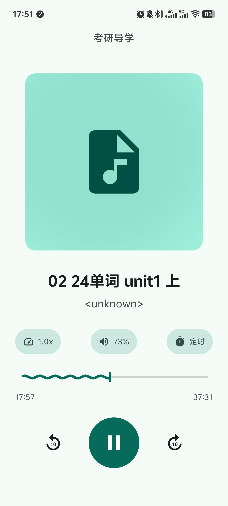
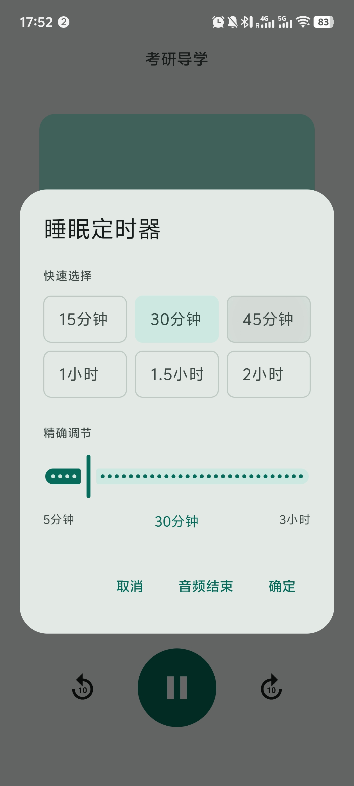
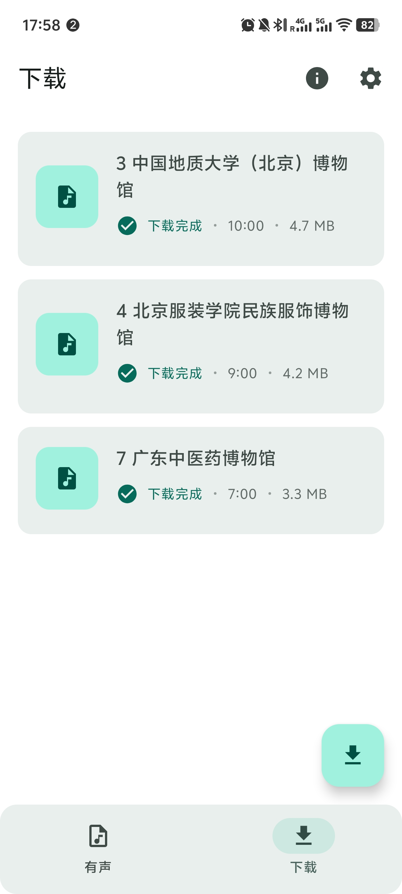
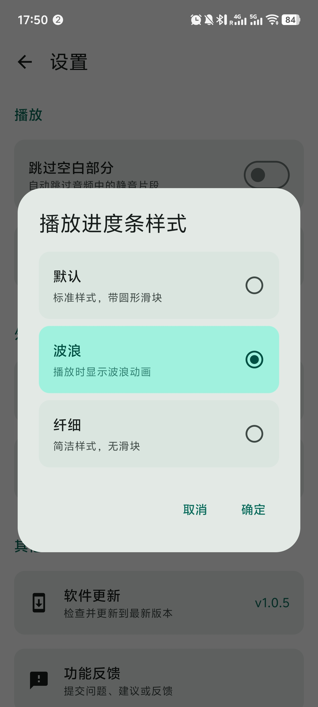
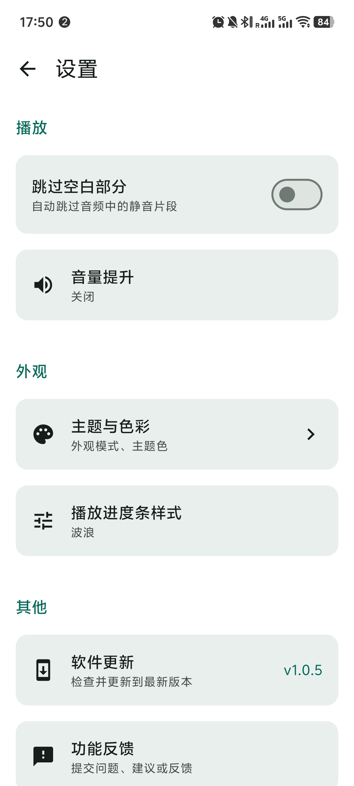

# XMVISIO

基于 Kotlin Multiplatform + Compose Multiplatform 构建的媒体播放应用。

## ✨ 功能

- 🎵 本地音频播放与管理
- 📥 在线视频/音频下载（基于 yt-dlp）
- 🎨 Material 3 主题，支持浅色/深色模式
- 📱 Android 原生应用
- ✅ 批量选择与批量操作
- 🗂️ 音频分类管理
- 🗑️ 批量删除功能

## 📸 应用截图

<div align="center">
  
  
  
</div>

<div align="center">
  
  
  
</div>

## 📋 环境要求

- JDK 21+
- Android Studio Ladybug (2024.2.1)+
- Android SDK API 27-35

## 🚀 快速开始

```bash
# 克隆项目
git clone repository-url

# 配置 Android SDK
echo "sdk.dir=/path/to/Android/sdk"  local.properties

# 构建 Debug APK
./gradlew :app:android:assembleDebug

# 构建 Release APK
./gradlew :app:android:assembleRelease
```

## 📁 项目结构

```
XMVISIO/
├── app/
│   ├── shared/          # 共享代码（UI 和业务逻辑）
│   ├── android/         # Android 启动器
│   └── desktop/         # Desktop 启动器
├── core/utils/          # 核心工具模块
└── buildSrc/            # 构建配置
```

## 📄 许可证

GPL-3.0 License
