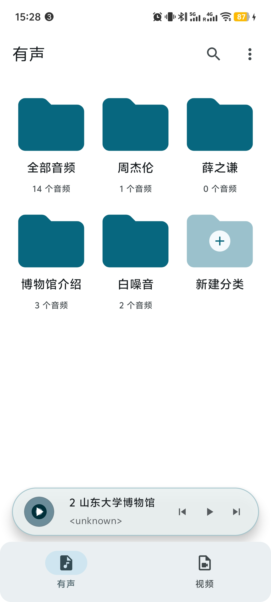
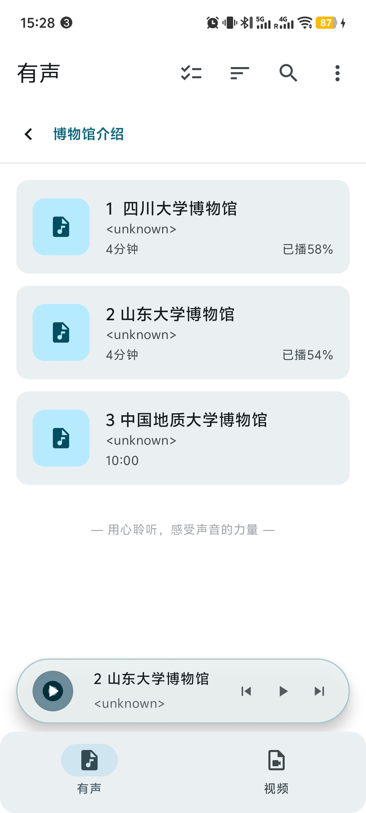
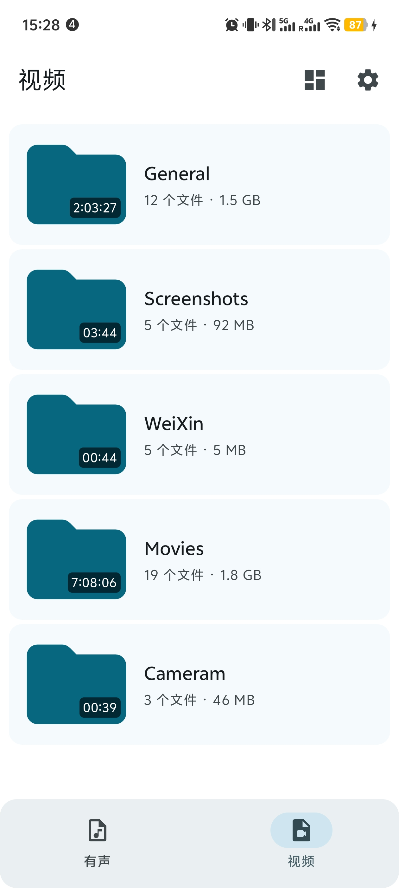
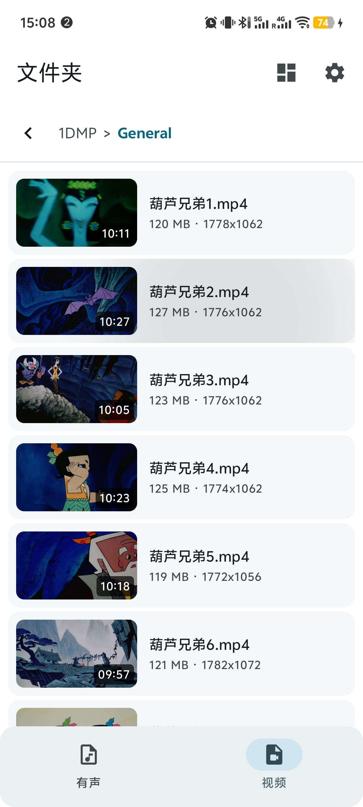
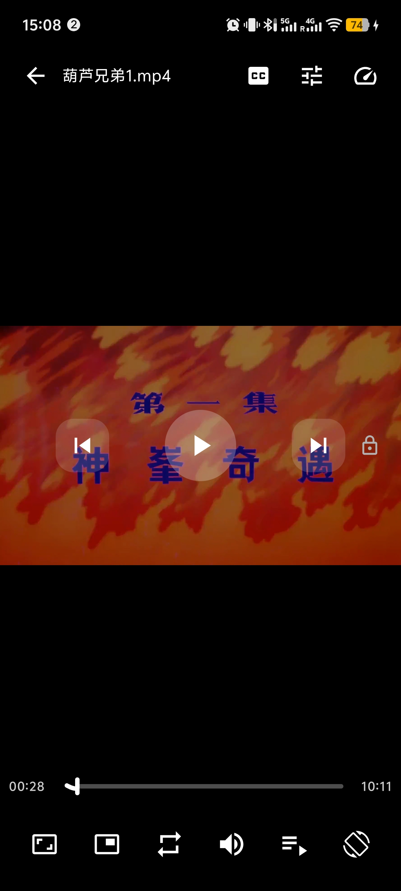
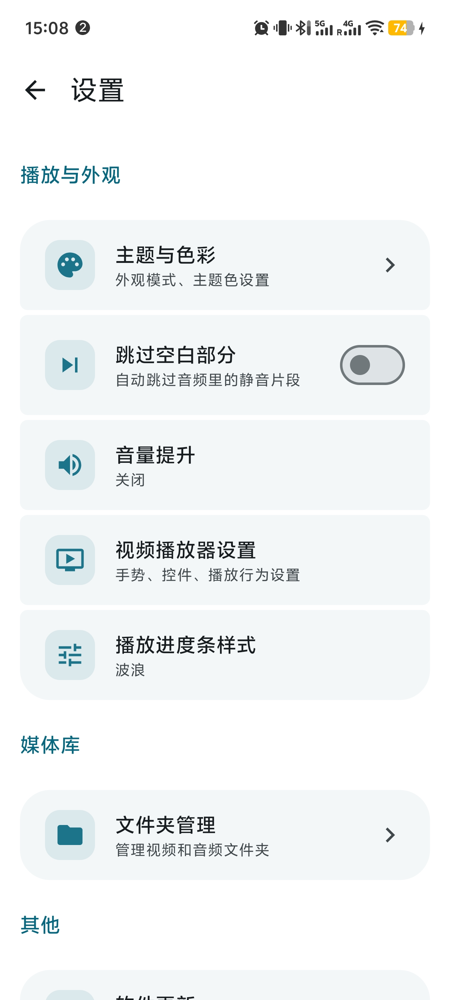

# XMVISIO

一个用 Kotlin Multiplatform + Compose Multiplatform 写的媒体播放应用，目前只做 Android 手机版。

最初是想给自己做个干净点的本地音频播放器，慢慢加了分类、批量管理这些日常用得上的功能。

## 功能

- **有声**：本地音频播放与管理
  - 音频分类整理（文件夹视图 / 分类管理）
  - 批量选择、批量移动、批量删除
  - 分类内拖拽排序，顺序持久化
  - 播放位置记忆（续播）、倍速播放、定时关闭
  - 最近播放、正在播放的迷你播放条
- **视频**：本地视频浏览与播放
  - 文件夹浏览 + 面包屑导航
  - 视频播放器（手势控制：进度、音量、亮度）
- 更新检查（APK 签名校验后安装）
- Material 3 界面，跟随系统深浅色
- 在线下载（yt-dlp）代码已在仓库里，但当前版本暂时关闭，之后会重新打开

## 截图

<div align="center">
  
  
  
</div>

<div align="center">
  
  
  
</div>

## 开发环境

- JDK 21
- Android SDK，API 27 到 35（minSdk 27，targetSdk 35）
- Android Studio 建议用较新版本

## 构建

先配置好 SDK 路径：

```bash
git clone <repository-url>
cd XMVISIO
echo "sdk.dir=/path/to/Android/sdk" > local.properties
```

然后按需要打包：

```bash
# Debug
./gradlew :app:android:assembleDebug

# Release（需要签名 keystore，见下）
./gradlew :app:android:assembleRelease
```

Release 包用的签名密钥不在仓库里。签名信息从 `local.properties`（已被 .gitignore 排除）或环境变量读取：

```properties
signing.storeFile=/path/to/your.keystore
signing.storePassword=xxx
signing.keyAlias=xxx
signing.keyPassword=xxx
```

未配置 `signing.storeFile` 时默认使用 `~/Desktop/xmvisio-release.keystore`。**不要把密码写进 `build.gradle.kts` 或任何会提交的文件里。**

## 测试

```bash
# 单元测试（JVM）
./gradlew :app:shared:testDebugUnitTest

# Instrumented UI 测试（需要连接模拟器/真机）
./gradlew :app:shared:connectedDebugAndroidTest
```

包含音频分类缓存逻辑、排序不弹回等回归场景的单元/UI 测试。

## 目录结构

```
XMVISIO/
├── app/
│   ├── shared/     # 共享的 UI 和业务逻辑，主要代码都在这
│   └── android/    # Android 入口
├── core/utils/     # 一些通用工具
└── buildSrc/       # 构建相关配置
```

只打包了 arm64-v8a，别的架构需要的话自己在 `app/android/build.gradle.kts` 里改 `abiFilters`。

> 桌面版已于 2026-08 移除，不再维护。当前版本：v1.0.8

## 许可证

GPL-3.0
